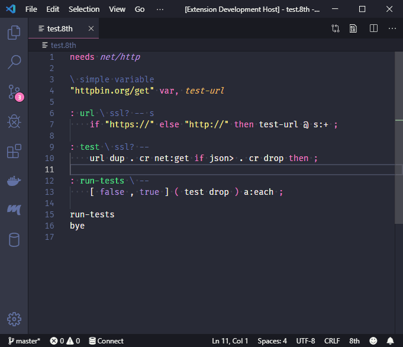

# Yadid

Yadid is a [Visual Studio Code][vscode] extension for the [8th][8th] programming langauge. Yadid ("friend" in Hebrew) gets its name from the fact that 8th's creator - [Ron Aaron][ron] - lives in Israel, and I like to think of this extension as a friendly contribution to the community.

## Features

Forth - and its derivatives - are actually quite frustrating to make an effective extension and syntax highlighter for. This is because they have little-to-no syntax and are very context dependent. For this reason, Yadid's primary goals are to provide:

* Context-aware syntax highlighting
* Quick running the current file as an 8th script
* Building the project in the current workspace

### Context-Aware Syntax Highlighting

Yadid's syntax highlighting has no intention - nor will it ever - of highlighting every known word in the dictionary. I personally believe this is not only difficult to maintain, but an eye sore and not effective. It would like a C syntax highlighter only calling attention to the libc functions and nothing else. Of what use is that to anyone? Instead, Yadid highlights words that fit one of the following criteria:

* Defining words (e.g. `:`, `var`, `ns:`, `constant`)
* State-changing words (e.g. `(`, `;`)
* Immediate words (e.g. `'`, `p:`)
* Control-flow words (e.g. `if`, `while`, `again`)
* Exiting words (e.g. `null;`, `;if`)

In addition, because Yadid is picky about this, it can go further and only highlight those words _in the state(s) they are legally allowed to be used in!_ This is where Yadid shines. For example, consider the following animation of code being edited and notice how the highlighting changes based on the state:



Notice how when defining the word `run-test` that `: run-tests` is no longer highlighted until after the definition of `run-test` is ended and back in interpret mode. And, when replacing the anonymous word `( test drop )` with `' run-test`, the closing `)` becomes unhighlighted once the opening `(` is deleted.

There are many of these situations for which I hope Yadid will be very helpful. I've found this especially true with respect to literal arrays and maps. For example, literal characters are not allowed in literal arrays (this has bit me multiple times) and so won't be highlighted there.

### Running 8th Scripts

The currently open file can be run as an 8th script with the "Run File" command (`F6`) or the "Run File with Arguments" (`Ctrl-F6`).

### Project Building

If open in an Workspace and there is a 8th build project setup in the folder, then the "Build Project" (`Ctrl-Shift-B`) command can be used to build it. Likewise, the "Launch Build GUI" command can be used to start the 8th build GUI to create a project, change its configuration, or build it.

## Requirements

This extension assumes you have `8th` installed, that it exists in your `PATH` somewhere, and (to build projects) that the `build` binary is up one directory from the `8th` executable as it would be in a standard installation.

## Known Issues and Quirks

In order to guarantee that what's highlighted is correct, there are a couple areas where what _isn't_ highlighted is valid 8th, but doesn't show that way:

Literal arrays and map items not padding the `,` delimiter:

```8th
[true,false]  \ valid 8th, but won't highlight correctly
```

Defining words on the different lines:

```8th
:
foo  \ valid 8th, but won't highlight correctly
;
```

Regular expressions are distinguished from `n:/` by assuming that any `/` paired with another `/` _with no whitespace between them_ is a regular expression. Of course, this means that a regular expression with whitespace in it won't highlight correctly.

The effort required to correct these (very minor) issues would be untenable, though. I can't see myself putting in the effort.

## Future Plans

There are a couple features that I'd still plan on adding:

* Highlighting stack notation comments (e.g. `\ n1 n2 -- n3`)
* Identify comments used for word definition help and highlight them
* Run script in an external shell as opposed to the embedded terminal
* Somehow add user-defined immediate words (`i:`) as to-be-highlighted

## Bugs and Feature Requests

If you find something that you think is wrong or have a feature request, feel free to open up an issue on [GitHub][issues]. Also, if you find this extension helpful and want to give a shout-out, a great place to do so would be on the [8th forums][forums]!

## Release Notes

Users appreciate release notes as you update your extension.

### 0.1.0

Initial release of Yadid to the world...


[vscode]: https://code.visualstudio.com/
[8th]: https://8th-dev.com/
[ron]: https://8th-dev.com/aboutus#ron
[forums]: https://8th-dev.com/forum
[issues]: https://github.com/massung/yadid/issues
